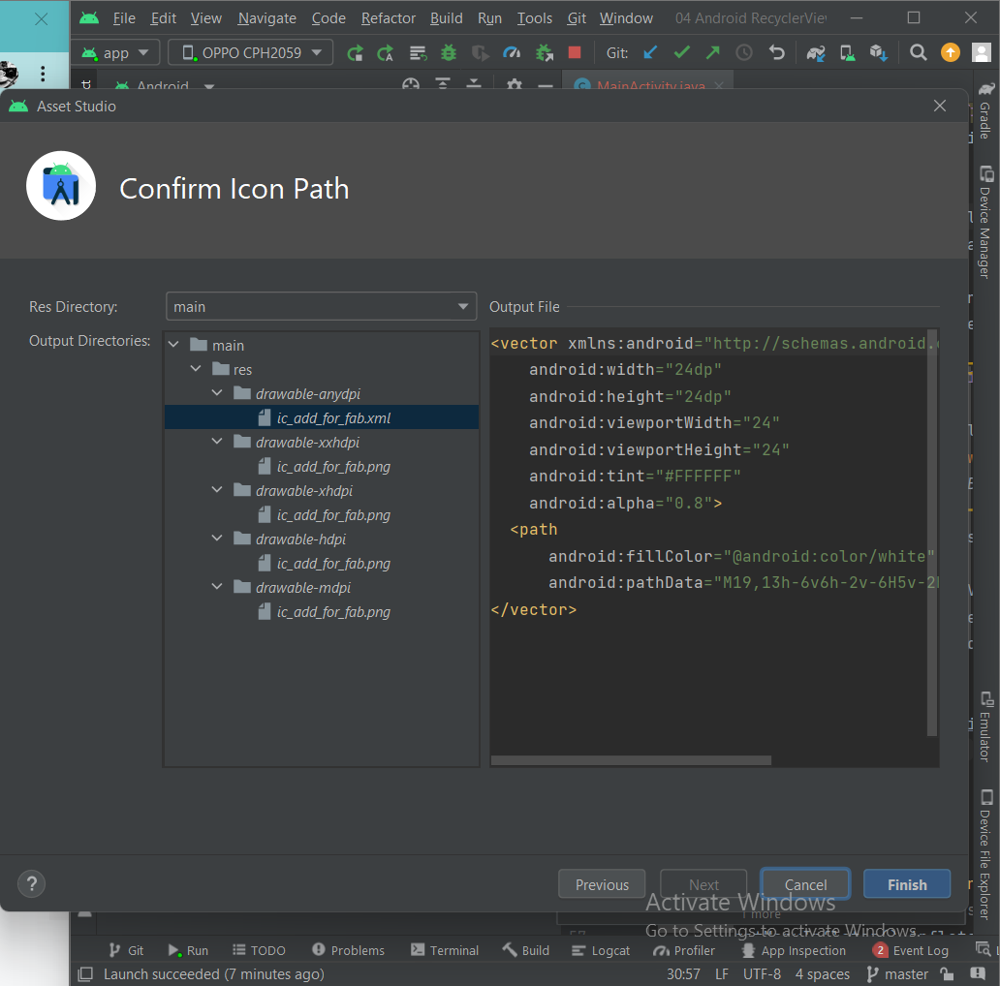
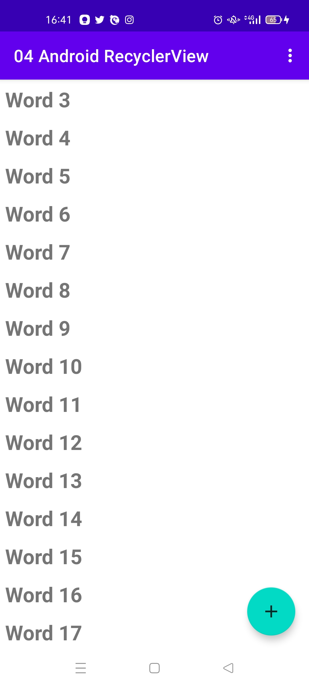
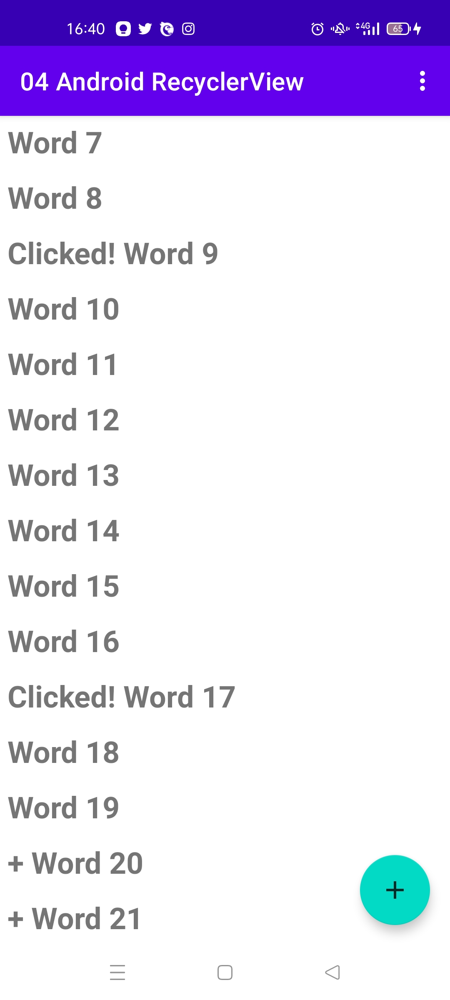
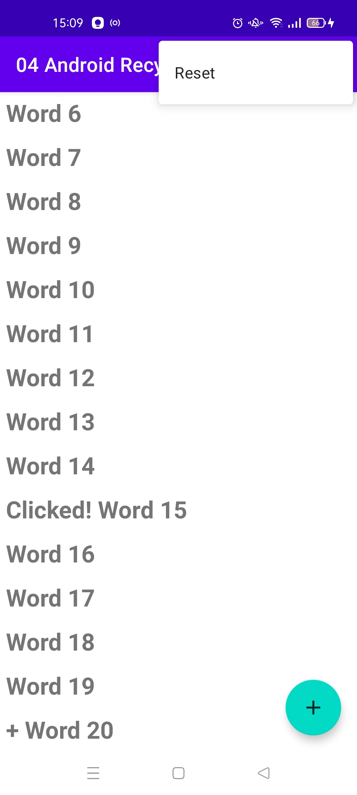
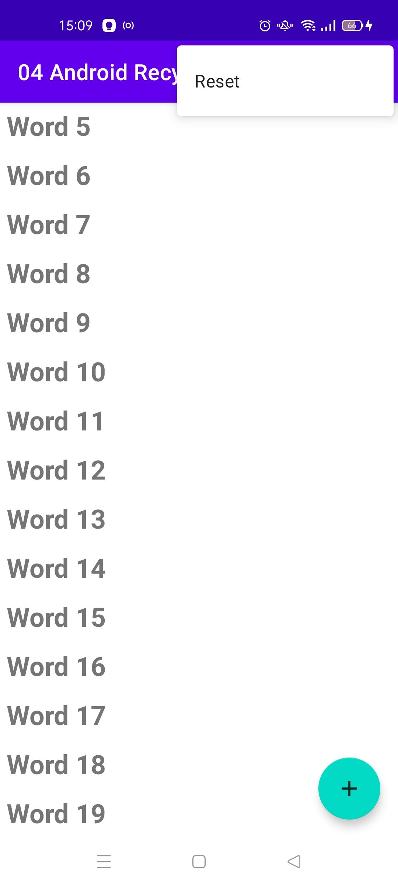

NIM  : 2041720099
Nama : Rofika Nur 'Aini
Kelas: TI-2B

Hasil Praktikum
Task 1: Create a new project and dataset

Task 2: Create a RecyclerView

Task 3: Make the list interactive

7. Coding challenges

